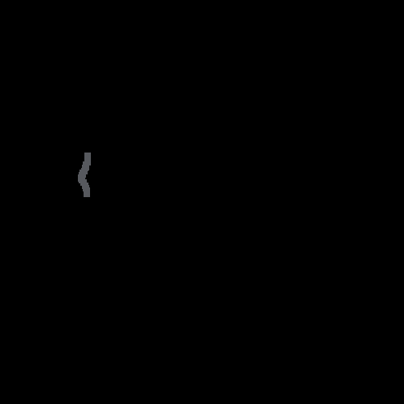

# Jumping JAX
Jumping JAX is an experimental falling-sand simulator implemented entirely in JAX (with PyGame used for display and user interactions). The simulator is essentially a cellular automaton that uses JAX to parallelize operations across cells on GPU.

<p  align="center">

</p>

## Quick Start
To run Jumping JAX, you need python3 installed, along with JAX, NumPy, imageio and pygame libraries. JAX should be installed with GPU support, it is hopelessly slow on CPU. With these installed you should be able to launch the simulator with the command
```bash
python3 jump.py
```
It takes under 1 minute to compile on my machine. The user interface is currently fairly primitive: click to place substance, use left and right arrows to cycle through available substances, use up and down arrows to change brush sizes, press Q to quit.

## Implementation Overview
The basic idea is to simulate particles falling and interacting on a grid using local updates which can be parallelized on GPU using JAX. Powders are simulated as particles that can move either directly down, or down and to the sides. Liquids can additionally move left and right. Powders and liquids fall into substances that are lighter than them. Fixed substances do not move at all and act as walls for other particles. In addition, particles can chemically interact with other particles in their area based on a prespecified set of interactions. Interactions can be unary (a->b), for example steam turning to water, or binary (ab->cd), for example fire and water turning to empty and steam. Each such interaction is associated with a weight that determines its probability relative to other possible interactions.

Substances and reactions are specified in the file substances.py and new ones can easily be added following the same format. However, removing stone or empty will cause the current script to crash as they are used to define the boundary and fill the screen respectively. Likewise, introducing reactions involving stone will cause weirdness at the boundary. Currently only unary and binary reactions are supported. The weight of an interaction represents an unnormalized probability of it occurring. The normalized probability is determined by dividing by the sum of all the weights of reactions that are possible for a given cell at a given time. The null reaction (which doesn't change anything) is assigned a default weight of 1.0 and always has some probability to occur. Thus, it isn't possible to set the probability of a reaction to one, but it can be made arbitrarily high relative to the null reaction.

Implementing this in parallel is made somewhat nontrivial by the fact that a naive implementation would allow more than one particle to attempt to move into the same cell at a time, for example, one grain of sand falling down-left and another down-right into the same destination. We get around this by updating different partitions of the grid sequentially in a manner that guarantees each destination cell can only be influenced by one cell in each partition. For Gravitational interactions, since particles can only move into one of 5 possible cells down and to the sides, partitioning based on the following tiling suffices:

1,2,3  
4,5,6

Note that particles can still appear to move up, like a gas, due to being displaced from above by a heavier particle and empty is also considered as a substance. For chemical interactions we constrain interaction to take place in cardinal directions, for which partitioning based on the following tiling suffices:

1,2,3,4,5,6  
5,6,1,2,3,4  
3,4,5,6,1,2

The simulator runs at around 60-70fps on my machine with a GTX 1080 GPU, however scaling with world-size and number of reactions is currently not great. Further improvements to the parallelization are likely possible and I hope to look into it more in the future. In any case, the current implementation represents an interesting demonstration of a somewhat atypical use-case for the GPU acceleration capabilities of JAX.

## Other Notes
See also: [Falling Turnip](https://github.com/tranma/falling-turnip) for a somewhat similar idea, using the Haskell library Repa.